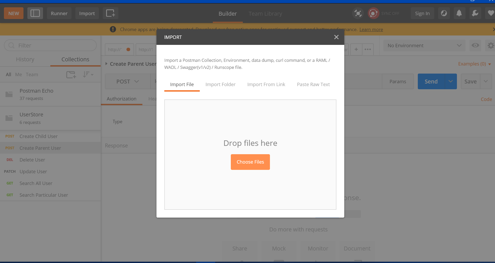

# User Store
[](https://www.python.org/downloads/release/python-360/)
[](https://pypi.org/project/Flask/)

## How to run the system

- Run a [mongodb](https://docs.mongodb.com/manual/tutorial/install-mongodb-on-windows/) server if you already don't have any.
- Seed the database
```
cd mongo-data
mongoimport --db userStore --collection "user" --drop --type json --host "localhost:27017" --file "UserStore.json" --jsonArray
```
- Install python dependencies `pip install -r requirements.txt`
- Run flask server `python app.py`

By default the server will run on `localhost:5000`

## Available API Endpoints: 

Import postman [collections](./docs/UserStore.postman_collection.json)



Check the individual requests and its description to get more detail.


